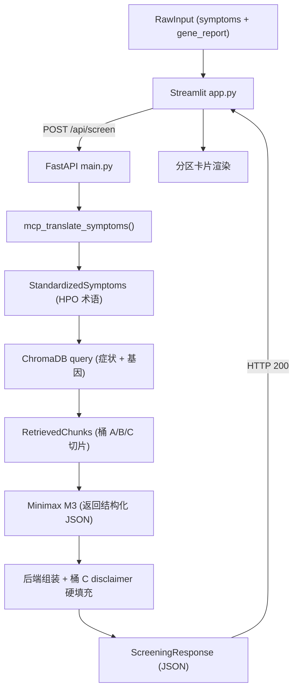

# PRD: ASD-GenDecoder (ASD 基因解码器)

> 机器可读产品需求文档 (Machine-Readable PRD)。断言式语句，供 AI 智能体直接落地写代码。
> 范围锁定：36 小时黑客松 MVP。凡未在 Must Have / Should Have 出现的功能，一律不写。
> 架构基线：以 [docs/env-setup.md](./env-setup.md) 的 FastAPI (后端) + Streamlit (前端) 双进程方案为准。

---

## 0. 技术约束 (Hard Constraints)

| 项 | 约束值 |
|---|---|
| 架构 | 双进程：FastAPI 后端 `main.py` + Streamlit 前端 `app.py`，前端经 HTTP 调后端 |
| 后端入口 | `main.py`，`uvicorn main:app --reload --port 8000` 启动 |
| 前端入口 | `app.py`，`streamlit run app.py` 启动；请求 `http://127.0.0.1:8000/api/screen` |
| 后端框架 | FastAPI + Uvicorn，唯一业务端点 `POST /api/screen` |
| 数据契约 | [docs/schema.md](./schema.md) 为前后端唯一事实来源；响应结构化拆分，错误以 HTTP 状态码承载 |
| LLM | Minimax M3，HTTP 调 `https://api.minimax.io/v1/chat/completions`，`model="MiniMax-M3"`，`temperature=0.3` |
| 术语标准化 | **真实 MCP 调用**：后端经 `mcp` Python SDK 起 stdio 子进程 `node $HPO_MCP_SERVER_PATH`，调用工具 `search_hpo_terms`。会话在 FastAPI `lifespan` 内常驻复用，禁止每请求重启 |
| MCP 语言约束 | HPO API 仅索引英文。链路必须为「M3 中译英抽关键词 → `search_hpo_terms` → M3 回填中文名」两段式 |
| 向量库 | ChromaDB 本地持久化 `PersistentClient(path="./chroma_db")`，单 collection `autism_genetics_knowledge`，桶 A/B/C 用 metadata `{"bucket": "A"/"B"/"C"}` 区分 |
| Embedding | `BAAI/bge-small-zh-v1.5`（中文模型，知识库为中文；灌库与检索两端必须一致。禁用纯英文的 `all-MiniLM-L6-v2`） |
| 灌库脚本 | `scripts/rag_builder.py` 读取 `data/knowledge/` 双来源语料，含章节过滤与用药词拦截 |
| 共享配置 | `config.py` 收口 collection 名、embedding 模型与数据目录，灌库与后端两端必须从它读取，禁止各写默认值 |
| 数据资产 | `data/knowledge/`（RAG 语料）、`data/fixtures/`（契约夹具）、`data/test_cases/`（验收用例） |
| 密钥 | `MINIMAX_API_KEY` 与 `HPO_MCP_SERVER_PATH` 读自根目录 `.env`（模板见 `.env.example`） |
| 运行环境 | Python 3.9+，虚拟环境 `.venv`，依赖锁定于 `requirements.txt` |
| 流水线 | 成功路径为线性、无回环的黑盒（Straight Line）；输入、配置或 HPO 无命中时允许按错误契约提前短路 |
| 合规 | 严格 Non-Device CDS：不诊断、不定性、不开药、不给剂量 |

- 断言：所有大模型输出必须由 RAG 检索片段支撑，禁止自由发挥。
- 断言：知识库内容仅来源于 [docs/后端知识库架构与数据字典.md](./后端知识库架构与数据字典.md) 的桶 A/B/C，不引入外部医学文本。
- 断言：前端不得直连 Minimax 或 ChromaDB；一切模型/检索调用只经由后端 `POST /api/screen`。

---

## 1. Key Features (MoSCoW)

### 1.1 Must Have — 跑通核心回路的底层逻辑（不可或缺）

- **M1 知识库灌注**：`scripts/rag_builder.py` 将**双来源**语料写入 ChromaDB `autism_genetics_knowledge`：`data/knowledge/*.json` 精编切片（`origin=curated`，始终入库）+ `data/knowledge/raw/*.txt` 原文切片。原文必须经章节过滤（丢弃 Management / Treatment / Surveillance 等干预章节）与用药词兜底扫描后方可入库。
- **M2 后端业务端点**：`main.py` 暴露 `POST /api/screen`，入参 `ScreeningRequest{symptoms: str, gene_report: str}`，串起 MCP → RAG → LLM → 合规收口全链路。
- **M3 MCP 标准化翻译**：后端经 `mcp` SDK **真实调用** HPO-MCP-Server 的 `search_hpo_terms`，把白话症状标准化为 `hpo_terms`。因 HPO API 仅索引英文，须先由 M3 将中文口语抽取为英文医学关键词，查得编码后再回填中文名。会话在 `lifespan` 内常驻复用。全部关键词均无命中时返回 HTTP 422 `HPO_NO_MATCH`，不进入 RAG/LLM 阶段。
- **M4 RAG 检索**：以「标准化症状 + 基因变异名」为查询键，检索 ChromaDB 返回相关切片（覆盖桶 A 鉴别锚点、桶 B VUS 安抚、桶 C 免责原文）。
- **M5 LLM 合成报告**：后端把 RAG 切片注入 system prompt，要求 Minimax M3 返回**结构化 JSON**（`comparisons` / `vus_reassurance` / `next_steps`）；`hpo_terms` 只采用 M3 → MCP → M3 标准化链路的结果，由后端合并。后端解析报告 JSON 并做降级容错（解析失败时返回 `MINIMAX_API_ERROR`，禁止把原始文本直接透传给前端）。
- **M6 强制合规收口**：成功响应的 `disclaimer` 字段由后端从桶 C **取原文直接填充**，不经 LLM 生成。此字段不受任何输入或模型输出影响，永远存在且内容固定。HTTP 错误响应遵循 `ErrorResponse`，不增加该字段；前端在错误态从桶 C 本地加载同一原文并持续展示。
- **M7 前端接入**：`app.py` 采集双输入，POST 至后端，按结构化字段分区渲染。

### 1.2 Should Have — 补全核心回路体验的前端交互

- **S1 Streamlit UI**：单页布局 = 症状输入框 + 基因报告输入框 + 「生成」按钮 + 报告展示区。
- **S2 分区卡片渲染**：`hpo_terms` 渲染为表型映射表；`comparisons` 渲染为逐病比对卡片（含命中锚点与文献来源）；`vus_reassurance` 与 `next_steps` 独立分区；`disclaimer` 固定置底且视觉强警示。以 `st.expander` 展示黑盒日志（`mcp_translation` + `retrieved_chunks`）。
- **S3 状态反馈**：生成中显示 `st.spinner`；后端返回 4xx/5xx 或连接失败时，读取 `error_message` 显示明确错误态，不白屏。

### 1.3 Could Have — 仅路演讲述 (Roadmap)，本次不开发

- **C1** 报告 PDF / 图片导出。
- **C2** 多轮追问与澄清对话。
- **C3** 扩充更多单基因病数据桶。
- **C4** HPO 术语置信度评分与人工纠偏（当前取 top hit，不做多候选排序）。
- **C5** 基因报告文件上传（当前契约 `gene_report` 为文本粘贴）。
- **C6** 筛查报告整体置信度评估（Confidence Level）。在 `ScreeningResponse` 顶层新增可选字段 `confidence_level: int`（0–100 整数），由后端基于「HPO 匹配数 × 文献命中数 × 变异与表型对齐度」综合评分，反映的是**本次筛查系统自身匹配结果的可信程度**——而非「用户确诊的可能性」。前端在 C-08 之后、C-11 之前渲染一行弱化标签（如「本次筛查可信度：78 / 100」），不得使用任何让人联想到「得病概率」的措辞（如「概率」「可能性」「几率」）。**保留在 Could Have**：本次不交付评分算法实现，但 schema 字段与 UI 渲染位预留，便于赛后迭代；MVP 后端必须省略该字段，不得输出 `null`，前端在字段缺失时不渲染此行。

### 1.4 Won't Have — Out of Scope（严禁开发）

- **W1** 用户登录 / 注册 / 账号体系。
- **W2** 会话历史持久化与多会话管理。
- **W3** 任何诊断结论、疾病定性、用药或剂量建议。
- **W4** 真实患者身份数据落库或上传存储。
- **W5** 多模态视频 / 眼动 / 音频分析。

---

## 2. Acceptance Criteria (AI 专属验收底线，断言式)

- **AC1**：`POST /api/screen` 传入非空且可标准化的 `symptoms` + 非空 `gene_report`，返回 200 且响应体含全部字段：`status`、`hpo_terms`、`comparisons`、`vus_reassurance`、`next_steps`、`disclaimer`、`mcp_translation`、`retrieved_chunks`；缺任一字段 = 失败。无法标准化时按 AC2 返回 422。
- **AC2**：`mcp_translate_symptoms()` 对可标准化的非空症状产出 ≥1 条 `hpo_terms`，每条含 `hpo_id`（形如 `HP:0000733`）与 `name`；全部英文关键词均无命中时，端点返回 HTTP 422 `HPO_NO_MATCH`，禁止以 HTTP 200 返回空 `hpo_terms`。
- **AC3**：`comparisons` 中每条 `explanation` 必须可回溯到 `retrieved_chunks` 切片；无检索命中时 `comparisons` 返回空数组且 `vus_reassurance` 给出「未匹配到相关指南」，禁止编造。
- **AC4**：任意成功响应中，`disclaimer` 必须为桶 C 逐字原文，且 `next_steps` 必须包含「儿童发育行为科」与「医学遗传科」。LLM 解析失败等 HTTP 错误路径返回统一 `ErrorResponse`，前端改用 `load_fallback_disclaimer()` 从桶 C 本地加载并逐字展示声明。
- **AC5**：`comparisons[].explanation`、`vus_reassurance`、`next_steps` 全文不得出现确诊 / 定性 / 处方类断言词（含「确诊」「患有」「即为」「需服用」「建议用药」）。
- **AC6**：错误一律以 HTTP 状态码承载，响应体为 `{status: "error", error_code, error_message}`。`INVALID_INPUT` → 422；`HPO_NO_MATCH` → 422；`MISSING_API_KEY` → 500；`MINIMAX_API_ERROR` → 502。缺少 API Key 时后端在启动阶段记录配置缺失但保持服务可用，由端点返回 `MISSING_API_KEY`。前端捕获并显示 `error_message`，进程不崩溃、不静默失败。
- **AC7**：先 `uvicorn main:app --port 8000` 再 `streamlit run app.py`，无需任何登录即可走完「双输入 → MCP → RAG → 报告」完整回路。
- **AC8**：前端两个输入框任一为空时，`st.warning` 拦截并提示补全，不向后端发起请求。
- **AC9**：`python scripts/run_acceptance.py` 全部用例通过（退出码 0）。该脚本读取 `data/test_cases/` 逐条校验 AC1-AC6，是本项目唯一的自动化验收门禁。
- **AC10**：入库的任何切片均不得含用药建议。`python scripts/rag_builder.py --dry-run` 输出的「丢弃干预/用药章节」与「用药词拦截」计数在有原文语料时必须大于 0；计数为 0 说明章节标题丢失、过滤未生效，判失败。

---

## 3. Entity Flow (核心流转实体与流向)

下图描述 HTTP 200 成功路径：单向、无回环。输入、配置、HPO 无命中或上游服务错误在对应阶段按 AC6 提前短路为 `ErrorResponse`。



- **核心实体链**：`ScreeningRequest` → `HPOTerms` → `RetrievedChunks` → `ScreeningResponse`。
- **实体定义**：
  - `ScreeningRequest`：`{ symptoms: str, gene_report: str }`，单层扁平，两字段均必填。
  - `HPOTerms`：`[{ hpo_id: "HP:0000733", name: str, matched_text: str }]`
  - `RetrievedChunks`：`[{ bucket: "A"|"B"|"C", origin: "curated"|"genereviews"|"pubmed"|"aap", source: str, text: str }]`，`origin` 透传 `scripts/rag_builder.py` 写入的 metadata，用于在调试面板区分精编摘要与文献原文
  - `ScreeningResponse`（HTTP 200）：
    ```json
    {
      "status": "success",
      "hpo_terms": [{ "hpo_id": "HP:0000733", "name": "刻板动作", "matched_text": "不停地搓手" }],
      "comparisons": [{ "condition": "Rett 综合征", "gene": "MECP2", "matched_anchors": ["语言发育倒退"], "explanation": "...", "source": "GeneReviews" }],
      "vus_reassurance": "...",
      "next_steps": ["..."],
      "disclaimer": "（桶 C 逐字原文，后端硬编码）",
      "mcp_translation": "...",
      "retrieved_chunks": [{ "bucket": "A", "origin": "curated", "source": "GeneReviews_MECP2", "text": "..." }],
      "confidence_level": 78
    }
    ```
  - `ErrorResponse`（HTTP 4xx/5xx）：`{ status: "error", error_code: "INVALID_INPUT"|"HPO_NO_MATCH"|"MISSING_API_KEY"|"MINIMAX_API_ERROR", error_message: str }`
- **契约细则**：以 [docs/schema.md](./schema.md) 为唯一事实来源，本节与其保持一致。
