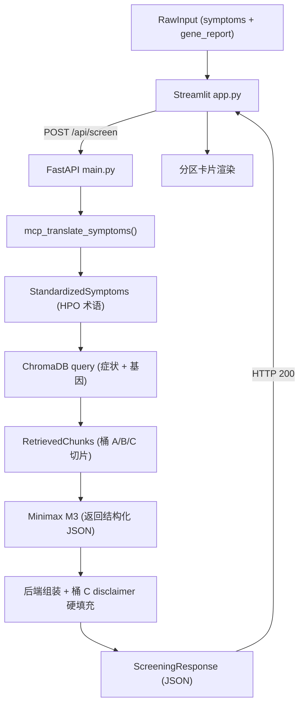

# PRD: ASD-GenDecoder (ASD 基因解码器)

> 机器可读产品需求文档 (Machine-Readable PRD)。断言式语句，供 AI 智能体直接落地写代码。
> 范围锁定：36 小时黑客松 MVP。凡未在 Must Have / Should Have 出现的功能，一律不写。
> 架构基线：以 [docs/env-setup.md](docs/env-setup.md) 的 FastAPI (后端) + Streamlit (前端) 双进程方案为准。

---

## 0. 技术约束 (Hard Constraints)

| 项 | 约束值 |
|---|---|
| 架构 | 双进程：FastAPI 后端 `main.py` + Streamlit 前端 `app.py`，前端经 HTTP 调后端 |
| 后端入口 | `main.py`，`uvicorn main:app --reload --port 8000` 启动 |
| 前端入口 | `app.py`，`streamlit run app.py` 启动；请求 `http://127.0.0.1:8000/api/screen` |
| 后端框架 | FastAPI + Uvicorn，唯一业务端点 `POST /api/screen` |
| 数据契约 | [docs/schema.md](docs/schema.md) 为前后端唯一事实来源；响应结构化拆分，错误以 HTTP 状态码承载 |
| LLM | Minimax M3，HTTP 调 `https://api.minimax.io/v1/chat/completions`，`model="MiniMax-M3"`，`temperature=0.3` |
| 术语标准化 | 后端函数 `mcp_translate_symptoms()`，目标接入 HPO-MCP-Server 工具 `search_hpo_terms`（关键词 → `HP:xxxxxxx`）；MVP 阶段允许桩实现，但输出契约不变 |
| 向量库 | ChromaDB 本地持久化 `PersistentClient(path="./chroma_db")`，单 collection `autism_genetics_knowledge`，桶 A/B/C 用 metadata `{"bucket": "A"/"B"/"C"}` 区分 |
| Embedding | `SentenceTransformerEmbeddingFunction(model_name="all-MiniLM-L6-v2")`（本地开源，前后端一致） |
| 灌库脚本 | `rag_builder.py` 一次性写入知识桶；检索逻辑复用于后端 |
| 密钥 | `MINIMAX_API_KEY` 读自根目录 `.env`（`python-dotenv`） |
| 运行环境 | Python 3.9+，虚拟环境 `.venv`，依赖锁定于 `requirements.txt` |
| 流水线 | 线性、无分叉、无回环的黑盒（Straight Line） |
| 合规 | 严格 Non-Device CDS：不诊断、不定性、不开药、不给剂量 |

- 断言：所有大模型输出必须由 RAG 检索片段支撑，禁止自由发挥。
- 断言：知识库内容仅来源于 [docs/后端知识库架构与数据字典.md](docs/后端知识库架构与数据字典.md) 的桶 A/B/C，不引入外部医学文本。
- 断言：前端不得直连 Minimax 或 ChromaDB；一切模型/检索调用只经由后端 `POST /api/screen`。

---

## 1. Key Features (MoSCoW)

### 1.1 Must Have — 跑通核心回路的底层逻辑（不可或缺）

- **M1 知识库灌注**：`rag_builder.py` 将桶 A/B/C 切片写入 ChromaDB `autism_genetics_knowledge`，每条切片带 `{"bucket": "A"/"B"/"C", "source": ...}` metadata。
- **M2 后端业务端点**：`main.py` 暴露 `POST /api/screen`，入参 `ScreeningRequest{symptoms: str, gene_report: str}`，串起 MCP → RAG → LLM → 合规收口全链路。
- **M3 MCP 标准化翻译**：后端 `mcp_translate_symptoms()` 把白话症状标准化为 HPO 术语（目标 `search_hpo_terms`，MVP 可桩），作为流水线唯一输入标准化入口。
- **M4 RAG 检索**：以「标准化症状 + 基因变异名」为查询键，检索 ChromaDB 返回相关切片（覆盖桶 A 鉴别锚点、桶 B VUS 安抚、桶 C 免责原文）。
- **M5 LLM 合成报告**：后端把 RAG 切片注入 system prompt，要求 Minimax M3 返回**结构化 JSON**（`hpo_terms` / `comparisons` / `vus_reassurance` / `next_steps`）；后端解析该 JSON 并做降级容错（解析失败时返回 `MINIMAX_API_ERROR`，禁止把原始文本直接透传给前端）。
- **M6 强制合规收口**：`disclaimer` 字段由后端从桶 C **取原文直接填充**，不经 LLM 生成。此字段不受任何输入或模型输出影响，永远存在且内容固定。
- **M7 前端接入**：`app.py` 采集双输入，POST 至后端，按结构化字段分区渲染。

### 1.2 Should Have — 补全核心回路体验的前端交互

- **S1 Streamlit UI**：单页布局 = 症状输入框 + 基因报告输入框 + 「生成」按钮 + 报告展示区。
- **S2 分区卡片渲染**：`hpo_terms` 渲染为表型映射表；`comparisons` 渲染为逐病比对卡片（含命中锚点与文献来源）；`vus_reassurance` 与 `next_steps` 独立分区；`disclaimer` 固定置底且视觉强警示。以 `st.expander` 展示黑盒日志（`mcp_translation` + `retrieved_chunks`）。
- **S3 状态反馈**：生成中显示 `st.spinner`；后端返回 4xx/5xx 或连接失败时，读取 `error_message` 显示明确错误态，不白屏。

### 1.3 Could Have — 仅路演讲述 (Roadmap)，本次不开发

- **C1** 报告 PDF / 图片导出。
- **C2** 多轮追问与澄清对话。
- **C3** 扩充更多单基因病数据桶。
- **C4** MCP 桩替换为真实 HPO-MCP-Server 长连接 + 术语置信度评分。

### 1.4 Won't Have — Out of Scope（严禁开发）

- **W1** 用户登录 / 注册 / 账号体系。
- **W2** 会话历史持久化与多会话管理。
- **W3** 任何诊断结论、疾病定性、用药或剂量建议。
- **W4** 真实患者身份数据落库或上传存储。
- **W5** 多模态视频 / 眼动 / 音频分析。

---

## 2. Acceptance Criteria (AI 专属验收底线，断言式)

- **AC1**：`POST /api/screen` 传入非空 `symptoms` + `gene_report`，返回 200 且响应体含全部字段：`status`、`hpo_terms`、`comparisons`、`vus_reassurance`、`next_steps`、`disclaimer`、`mcp_translation`、`retrieved_chunks`；缺任一字段 = 失败。
- **AC2**：`mcp_translate_symptoms()` 对任一非空症状必产出 ≥1 条 `hpo_terms`，每条含 `hpo_id`（形如 `HP:0000733`）与 `name`；返回空数组 = 失败。
- **AC3**：`comparisons` 中每条 `explanation` 必须可回溯到 `retrieved_chunks` 切片；无检索命中时 `comparisons` 返回空数组且 `vus_reassurance` 给出「未匹配到相关指南」，禁止编造。
- **AC4**：任意执行路径（含 LLM 解析失败的降级路径）下，`disclaimer` 必须为桶 C 逐字原文，且 `next_steps` 必须包含「儿童发育行为科」与「医学遗传科」。
- **AC5**：`comparisons[].explanation`、`vus_reassurance`、`next_steps` 全文不得出现确诊 / 定性 / 处方类断言词（含「确诊」「患有」「即为」「需服用」「建议用药」）。
- **AC6**：错误一律以 HTTP 状态码承载，响应体为 `{status: "error", error_code, error_message}`。`INVALID_INPUT` → 422；`MISSING_API_KEY` → 500；`MINIMAX_API_ERROR` → 502。前端捕获并显示 `error_message`，进程不崩溃、不静默失败。
- **AC7**：先 `uvicorn main:app --port 8000` 再 `streamlit run app.py`，无需任何登录即可走完「双输入 → MCP → RAG → 报告」完整回路。
- **AC8**：前端两个输入框任一为空时，`st.warning` 拦截并提示补全，不向后端发起请求。

---

## 3. Entity Flow (核心流转实体与流向)

单向流，无回环，无分支。HTTP 边界隔开前端与后端。



- **核心实体链**：`ScreeningRequest` → `HPOTerms` → `RetrievedChunks` → `ScreeningResponse`。
- **实体定义**：
  - `ScreeningRequest`：`{ symptoms: str, gene_report: str }`，单层扁平，两字段均必填。
  - `HPOTerms`：`[{ hpo_id: "HP:0000733", name: str, matched_text: str }]`
  - `RetrievedChunks`：`[{ bucket: "A"|"B"|"C", source: str, text: str }]`
  - `ScreeningResponse`（HTTP 200）：
    ```json
    {
      "status": "success",
      "hpo_terms": [{ "hpo_id": "HP:0000733", "name": "刻板动作", "matched_text": "不停地搓手" }],
      "comparisons": [{ "condition": "Rett 综合征", "gene": "MECP2", "matched_anchors": ["语言发育倒退"], "explanation": "...", "source": "GeneReviews" }],
      "vus_reassurance": "...",
      "next_steps": ["..."],
      "disclaimer": "（桶 C 逐字原文，后端硬编码）",
      "mcp_translation": "...",
      "retrieved_chunks": [{ "bucket": "A", "source": "GeneReviews_MECP2", "text": "..." }]
    }
    ```
  - `ErrorResponse`（HTTP 4xx/5xx）：`{ status: "error", error_code: "INVALID_INPUT"|"MISSING_API_KEY"|"MINIMAX_API_ERROR", error_message: str }`
- **契约细则**：以 [docs/schema.md](docs/schema.md) 为唯一事实来源，本节与其保持一致。
