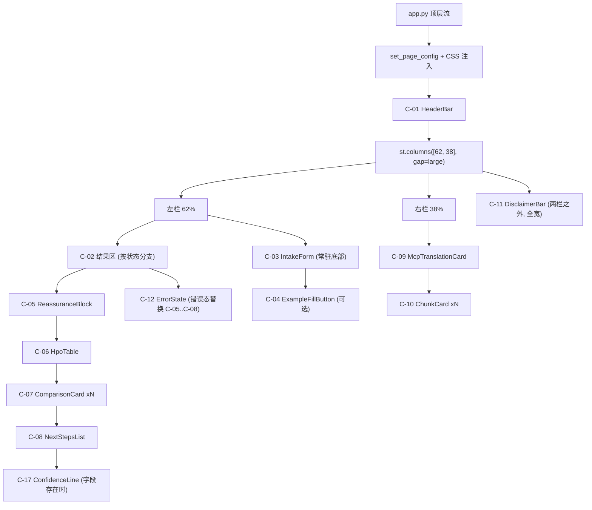
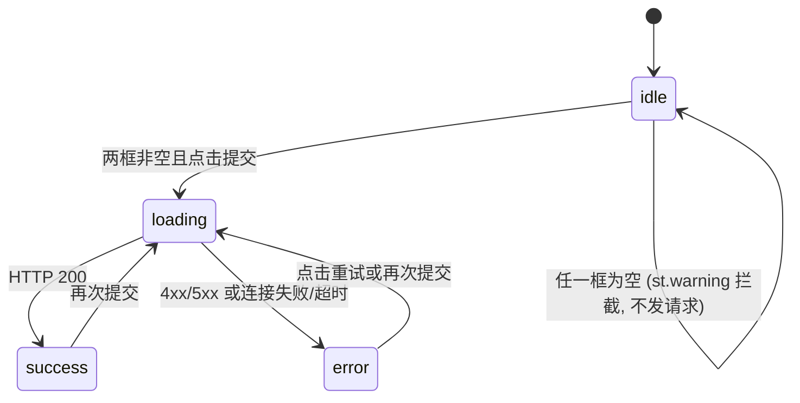

# UI 蓝图：静谧证据台 (Calm Evidence Desk)

> 前端唯一视觉事实来源。目标产物：单文件 Streamlit 应用 `app.py`。
> 断言式文档，供前端智能体直接落地写代码。凡本文未定义的视觉元素，一律不加。
>
> **优先级链**：[docs/schema.md](schema.md)（数据契约）＞ [docs/PRD.md](PRD.md)（功能与合规）＞ 本文档（视觉与布局）。
> 三者冲突时数据与合规优先，本文档让路；但在三者均未规定处，本文档是终裁。
>
> 配套数据：[data/fixtures/mock_response.success.json](../data/fixtures/mock_response.success.json)、[data/fixtures/mock_response.error.json](../data/fixtures/mock_response.error.json)、[data/knowledge/bucket_c_compliance.json](../data/knowledge/bucket_c_compliance.json)

---

## 0. 硬约束 (Hard Constraints)

| 项 | 约束值 |
|---|---|
| 产物 | 单文件 `app.py`，`streamlit run app.py` 启动 |
| 框架 | Streamlit ≥ 1.31（需 `st.columns(gap=)`、`st.container(border=)`）。禁止引入 `streamlit-extras` 等任何第三方 UI 组件库 |
| 主题 | 必须新建 `.streamlit/config.toml` 钉死浅色主题（见 §1.5）。不钉死则 OS 深色模式下文字不可读 |
| 样式注入 | 全部样式由**一次** `st.markdown(CSS, unsafe_allow_html=True)` 注入，位置在 `st.set_page_config()` 之后、任何内容之前。禁止散落多处注入 |
| JS | 零 JavaScript。禁止 `components.html` 承载业务渲染 |
| 后端地址 | 从 `.env` 读 `BACKEND_URL`，缺省 `http://127.0.0.1:8000`；请求 `POST {BACKEND_URL}/api/screen`，超时 120s |
| 数据来源 | 前端只消费 `POST /api/screen` 的响应。禁止直连 Minimax / ChromaDB / HPO |
| 会话 | 单轮单结果。`st.session_state` 只存一份，禁止历史列表、禁止登录入口、禁止侧边栏（W1/W2） |
| Mock | 常量 `USE_MOCK: bool` 切换。为 True 时读 fixtures 文件而不发请求，渲染路径与真实响应完全一致 |
| 字符 | 界面内禁止 emoji。允许的非文字符号仅限 `①②③④⑤⑥⑦⑧⑨` 与 `•` |
| 颜色 | 只允许使用 §1.1 令牌表中的色值。全局禁止纯红系（`#F00` / `#FF4B4B` / Streamlit 默认 error 红） |

**断言**：`disclaimer` 在任何状态下都必须完整、逐字、不可折叠地出现在页面上（PRD AC4 / schema I1）。禁止对其做截断、省略号、`line-clamp`、改写或摘要。

---

## 1. 设计令牌 (Design Tokens)

### 1.1 颜色

| 令牌 | 值 | 用途 |
|---|---|---|
| `--bg-canvas` | `#FAFAF7` | 页面底色，暖纸白 |
| `--bg-surface` | `#FFFFFF` | 卡片、气泡 |
| `--bg-panel` | `#F4F3EE` | 右栏证据面板底色，比画布深半阶 |
| `--brand` | `#5B8C85` | 主色雾霭青：按钮底、边框、图形块 |
| `--brand-strong` | `#47726C` | 主色深化版：**≤14px 的彩色文字与链接必须用此色**（`--brand` 在白底上对比度仅 3.6:1，不达标） |
| `--brand-soft` | `#E4EFEC` | 胶囊底、选中态、高亮 |
| `--text-primary` | `#1F2321` | 正文 |
| `--text-muted` | `#7A807C` | ≥16px 的次要文字 |
| `--text-muted-strong` | `#636965` | **≤14px 的次要文字（来源、脚注、编号）必须用此色**，保证 4.5:1 |
| `--border` | `#E6E4DD` | 1px 描边，全局唯一分隔手段（禁止使用 `<hr>` 之外的分隔线样式） |
| `--bucket-a` | `#5B8C85` | 桶 A 标签文字 |
| `--bucket-a-soft` | `#E4EFEC` | 桶 A 标签底 |
| `--bucket-b` | `#7C6BA8` | 桶 B 标签文字 |
| `--bucket-b-soft` | `#EDE9F5` | 桶 B 标签底 |
| `--bucket-c` | `#C08A3E` | 桶 C 标签文字、免责条边框、错误态边框 |
| `--bucket-c-soft` | `#F7EDDC` | 桶 C 标签底、免责条底、错误卡底 |
| `--radius` | `12px` | 卡片圆角；胶囊固定 `999px` |
| `--shadow` | `0 1px 3px rgba(31,35,33,.06)` | 仅卡片，禁止任何更重的投影 |

### 1.2 字体

不使用远程 `@import`（路演现场断网即崩）。系统字体栈：

- 正文 `--font-sans`：`-apple-system, BlinkMacSystemFont, "PingFang SC", "Noto Sans SC", "Microsoft YaHei", Inter, sans-serif`
- 等宽 `--font-mono`：`"JetBrains Mono", "SF Mono", Menlo, Consolas, monospace`

**等宽字体的使用范围是封闭集合**，只允许出现在这四处：`hpo_id`、基因位点与 `gene` 字段、`Chunk.source` 与 `Comparison.source`、引用编号。其余一律无衬线。

字重只用 `400` 与 `600`，禁止 `700`/`bold`/`italic`。

### 1.3 字号阶梯

| 名称 | 字号 / 行高 | 用途 |
|---|---|---|
| `display` | 24px / 1.4 / 600 | 产品名 |
| `title` | 18px / 1.5 / 600 | 卡片标题、分区标题 |
| `quote` | 17px / 1.9 / 400 | `vus_reassurance` 正文 |
| `body` | 16px / 1.8 / 400 | 全站正文默认 |
| `small` | 13px / 1.6 / 400 | 来源、脚注、标签、引用编号 |

### 1.4 间距

只允许 `4 / 8 / 12 / 16 / 24 / 32 / 48` 七档（px）。卡片内边距统一 `20px`，卡片之间间距统一 `16px`，分区之间 `32px`。

### 1.5 `.streamlit/config.toml`（必须创建）

```toml
[theme]
base = "light"
primaryColor = "#5B8C85"
backgroundColor = "#FAFAF7"
secondaryBackgroundColor = "#F4F3EE"
textColor = "#1F2321"

[client]
toolbarMode = "minimal"
```

---

## 2. 页面骨架

### 2.1 线框

```
┌──────────────────────────────────────────────────────────────────────────┐
│  ASD-GenDecoder · 就诊前置信息整理                          [HeaderBar]  │
│  帮你把孩子的表现和基因报告，翻译成可以带去门诊的语言                    │
├────────────────────────────────────┬─────────────────────────────────────┤
│  左栏 · 对话流 (62%)               │  右栏 · 证据面板 (38%, sticky)      │
│                                    │                                     │
│  ┌ AssistantBubble ─────────────┐  │  证据来源                           │
│  │ [C-05] 关于 VUS…（大字引文） │  │  ┌ [C-09] MCP 标准化过程 ────────┐ │
│  │                              │  │  │ mcp_translation 全文          │ │
│  │ [C-06] 表型对照表            │  │  └───────────────────────────────┘ │
│  │   家长原话 │ HPO 术语 + 编码 │  │  ┌ [C-10] ① [桶A][精编] source ─┐ │
│  │                              │  │  │ chunk.text                    │ │
│  │ [C-07] 需请医生一并排除      │  │  └───────────────────────────────┘ │
│  │   ┌ Rett 综合征  [MECP2] ─┐  │  │  ┌ [C-10] ② [桶A][GeneReviews] ─┐ │
│  │   │ (锚点胶囊)(锚点胶囊)  │  │  │  │ chunk.text                    │ │
│  │   │ explanation 正文…     │  │  │  └───────────────────────────────┘ │
│  │   │              来源 ①   │  │  │  … ③ ④ ⑤                          │
│  │   └───────────────────────┘  │  │                                     │
│  │                              │  │                                     │
│  │ [C-08] 下一步就诊清单        │  │                                     │
│  └──────────────────────────────┘  │                                     │
│                                    │                                     │
│  ┌ [C-03] IntakeForm ───────────┐  │                                     │
│  │ 孩子的情况      (3 行)       │  │                                     │
│  │ 基因报告原文    (4 行, mono) │  │                                     │
│  │              [生成信息整理单]│  │                                     │
│  └──────────────────────────────┘  │                                     │
├────────────────────────────────────┴─────────────────────────────────────┤
│ ▌[C-11] DisclaimerBar — 桶 C 逐字原文，全宽，任何状态下恒存               │
└──────────────────────────────────────────────────────────────────────────┘
```

### 2.2 组件树与渲染顺序

DOM 顺序即代码调用顺序，不可调换。



### 2.3 栅格

- `st.set_page_config(page_title="ASD-GenDecoder", layout="wide", initial_sidebar_state="collapsed")`，必须是第一条 Streamlit 调用。
- 主容器最大宽度 `1180px` 居中，左右留白 `32px`。
- `st.columns([62, 38], gap="large")`。
- 右栏尝试 `position: sticky; top: 8px;`。**该效果依赖 Streamlit 内部 DOM 结构，若一次尝试不生效则放弃，退化为普通文档流，不得为此改动布局或引入 JS。**
- 窗口宽度 < 900px 时 Streamlit 自动堆叠为单列，证据面板落到对话流下方，此行为可接受，无需额外适配。

---

## 3. 状态机

`st.session_state` 键：`stage`（`"idle" | "loading" | "success" | "error"`）、`payload`（成功响应 dict）、`err`（`{error_code, error_message}`）、`symptoms`、`gene_report`。



各状态下各区域的渲染内容：

| 区域 | idle | loading | success | error |
|---|---|---|---|---|
| C-01 HeaderBar | 渲染 | 渲染 | 渲染 | 渲染 |
| 左栏结果区 | C-13 空态引导语 | C-14 加载态 | C-05→C-06→C-07→C-08→C-17(可选) | C-12 错误卡 |
| C-03 IntakeForm | 可编辑 | 全部控件 `disabled=True` | 可编辑，**保留上次输入内容** | 可编辑，**保留上次输入内容** |
| 右栏证据面板 | C-15 面板占位说明 | C-15 面板占位说明 | C-09 + C-10×N | C-15 面板占位说明 |
| C-11 DisclaimerBar | 渲染（回退文案源） | 渲染（回退文案源） | 渲染（响应 `disclaimer`） | 渲染（回退文案源） |

**回退文案源**：非成功态没有响应体，`disclaimer` 从 [data/knowledge/bucket_c_compliance.json](../data/knowledge/bucket_c_compliance.json) 中 `is_disclaimer == true` 的那条取 `text`，启动时读一次缓存。**禁止在 `app.py` 里硬编码该段文字**，否则与桶 C 原文双写必然漂移，直接违反不变量 I1。若文件读取失败，则回退为空字符串并渲染一行 `无法加载合规声明文本，请检查 data/knowledge/bucket_c_compliance.json`，用 C-11 的琥珀样式呈现——**绝不静默隐藏免责条**。

---

## 4. 字段 → 组件映射总表

这是本文档的核心。`ScreeningResponse` 的每一个字段都必须在界面上有唯一落点，无遗漏、无重复渲染。

| JSON 路径 | 落点组件 | 栏位 · 次序 | 视觉呈现 | 空值 / 异常 |
|---|---|---|---|---|
| `status` | 无 | — | 不渲染，仅驱动状态机 | 非 `"success"` 按 error 处理 |
| `vus_reassurance` | C-05 | 左 · 1 | `quote` 字号，左侧 3px `--bucket-b` 竖线，无卡片边框 | 空字符串则整块不渲染 |
| `hpo_terms[]` | C-06 | 左 · 2 | 两列对照表，每项一行 | 长度 0 时显示「本次未能标准化出表型术语」，不崩溃 |
| `hpo_terms[].matched_text` | C-06 | 左列 | `body`，`--text-primary`，用 `「」` 包裹 | 缺失显示 `—` |
| `hpo_terms[].name` | C-06 | 右列 | `body` / 600 | 缺失显示 `—` |
| `hpo_terms[].hpo_id` | C-06 | 右列 | `small` + `--font-mono` + `--text-muted-strong`，`name` 后空 8px | 缺失则只显示 `name` |
| `comparisons[]` | C-07 | 左 · 3 | 每项一张描边卡，卡间距 16px | **长度 0 时渲染 C-16 静默态，禁止渲染任何替代性推测内容**（AC3 / I8） |
| `comparisons[].condition` | C-07 | 卡片标题 | `title` | 缺失显示「未命名比对项」 |
| `comparisons[].gene` | C-07 | 标题右侧 | `small` + mono，`--brand-soft` 底胶囊 | 空字符串则不渲染该胶囊 |
| `comparisons[].matched_anchors[]` | C-07 | 标题下方 | 每项一枚胶囊：`--brand-soft` 底 + `--brand-strong` 字，`small` | 空数组则整行不渲染 |
| `comparisons[].explanation` | C-07 | 卡片正文 | `body`，**全文渲染，禁止截断或折叠** | 缺失则整卡不渲染 |
| `comparisons[].source` | C-07 | 卡片右下角 | `small` + mono + `--text-muted-strong`，格式 `来源：{source} ①`，编号规则见 §5 | 无匹配切片时只显示来源、不显示编号 |
| `next_steps[]` | C-08 | 左 · 4 | 有序清单，每项一行，行首方形序号块 | 长度 0 时整块不渲染（但这违反 I2，属后端 Bug，前端不掩盖：额外渲染一行琥珀提示「就诊建议缺失」） |
| `confidence_level` | C-17 | 左 · 5 | 弱化标签行，单行 `small` + `--text-muted-strong`，文案「本次筛查可信度：{n} / 100」，不带边框/卡片 | 字段缺失或不在 0–100 范围则整行不渲染（符合 PRD C6 Roadmap 阶段定义） |
| `disclaimer` | C-11 | 全宽 · 页面末 | 见 §6.11 | 见 §3 回退文案源 |
| `mcp_translation` | C-09 | 右 · 1 | 面板首卡，`body`，标题「术语标准化过程」 | 空字符串则渲染卡片外壳 + `—` |
| `retrieved_chunks[]` | C-10 | 右 · 2..N | 每切片一卡，**按数组顺序编号 ①②③…** | 长度 0 时渲染「本次未检索到知识库切片」 |
| `retrieved_chunks[].bucket` | C-10 | 卡片左上 | 三色标签，文案映射见下 | 非 A/B/C 时按灰色「未知」渲染，不崩溃 |
| `retrieved_chunks[].origin` | C-10 | 桶标签右侧 | 次级灰标签（`--bg-panel` 底 + `--text-muted-strong` 字），文案映射见下 | 缺失或未知值时不渲染该标签 |
| `retrieved_chunks[].source` | C-10 | 卡片头右侧 | `small` + mono + `--text-muted-strong` | 缺失显示 `—` |
| `retrieved_chunks[].text` | C-10 | 卡片正文 | `small` / 1.7；超过 180 字时用原生 `<details>` 折叠，摘要行为前 180 字 + `…` | 缺失显示 `—` |
| `error_code` | C-12 | 左栏 | 映射为标题文案，见 §6.12 | 未知码用「请求失败」 |
| `error_message` | C-12 | 左栏 | `body`，原样展示，不改写 | 缺失显示「后端未返回错误详情」 |

**`bucket` 文案映射**：`A` → `桶 A · 鉴别锚点`；`B` → `桶 B · VUS 科普`；`C` → `桶 C · 合规声明`。

**`origin` 文案映射**：`curated` → `精编摘要`；`genereviews` → `GeneReviews 原文`；`pubmed` → `PubMed 原文`；`aap` → `AAP 指南原文`。

**禁止项**：不得用 `st.dataframe` / `st.table` 渲染 `hpo_terms`（默认样式无法纳入本主题）；不得用 `st.json` 展示任何响应字段；不得把 `retrieved_chunks` 塞进 `st.expander` 的默认灰框里——它是右栏的一等公民，不是调试折叠区。

---

## 5. 证据回溯：引用编号机制

这是本方案的立身之本——把不变量 I7「每个论断可回溯到某个切片」变成肉眼可见的东西。原设想的「点击滚动定位 + 高亮」需要 JS，本项目零 JS，因此采用**确定性编号**方案。

### 5.1 规则

1. `retrieved_chunks` 按数组下标固定编号：下标 0 → ①，1 → ②，依此类推，最多 ⑨；超过 9 条时第 10 条起用 `(10)` 形式的纯文本。编号在 C-10 卡片左上角常驻。
2. 每张 C-07 比对卡的页脚，在 `来源：{source}` 之后追加其匹配到的切片编号。
3. 匹配纯前端计算，不改动契约，不向后端要新字段。

### 5.2 匹配算法（伪码，无歧义）

```text
GENERIC_TOKENS = {
  "genereviews", "pubmed", "aap", "acmg", "fda", "curated",
  "related", "disorders", "disorder", "syndrome", "review", "reviews",
  "the", "of", "and", "a", "an"
}

tokenize(s):
    小写 → 所有非字母数字字符替换为空格 → 按空格切分 → 去空串
    返回 token 集合

score(comparison, chunk):
    ct = tokenize(chunk.source)
    pt = tokenize(comparison.source)
    s = 0
    if tokenize(comparison.gene) 非空 且 是 ct 的子集:  s += 2
    s += |(pt - GENERIC_TOKENS) ∩ (ct - GENERIC_TOKENS)|
    return s

match(comparison, chunks):
    scores = [score(comparison, c) for c in chunks]
    best = max(scores)
    if best == 0: 返回 空列表          # 无匹配，只显示来源不显示编号
    返回 所有 score == best 的下标，按下标升序，最多取 2 个
```

### 5.3 对现有 fixtures 的期望输出（可直接当断言用）

以 [data/fixtures/mock_response.success.json](../data/fixtures/mock_response.success.json) 为输入：

- 切片编号：① `GeneReviews_MECP2`(A/curated)、② `genereviews_ube3a_angelman`(A/genereviews)、③ `ACMG_VUS_PMID37878314`(B/curated)、④ `pubmed_33921431_wes_value`(B/pubmed)、⑤ `FDA_NonDeviceCDS_Disclaimer`(C/curated)。
- `comparisons[0]`「Rett 综合征 / MECP2」→ 命中 ①（`mecp2` 同时满足基因子集与 token 交集，得 3 分；其余切片 0 分）。页脚显示 `来源：GeneReviews - MECP2-Related Disorders ①`。
- `comparisons[1]`「安格曼综合征 / UBE3A」→ 命中 ②（`ube3a` 基因子集 +2，`angelman` token 交集 +1，共 3 分）。页脚显示 `来源：GeneReviews - Angelman Syndrome ②`。

**若实现后跑 Mock 得不到上述编号，是实现错了，不是算法错了。**

### 5.4 禁止项

- 禁止在无匹配时随便挂一个编号凑数——宁可不显示。这条与 I8「宁可少说也不编造」同源。
- 禁止用编号暗示「证据强度」或「置信度」，它只是定位符。不得为编号加颜色深浅、星级或百分比。

---

## 6. 组件规格

每个组件给出：数据源、结构、样式要点、边界处理。CSS 类名统一 `ced-` 前缀（Calm Evidence Desk）。所有自定义 HTML 通过 `st.markdown(..., unsafe_allow_html=True)` 输出，**每个组件一次调用，禁止跨组件拼接一整坨 HTML**（否则一处报错整页塌陷）。

### C-01 HeaderBar

- 数据源：静态。
- 结构：主标题 `ASD-GenDecoder · 就诊前置信息整理`（`display`）；副标题 `帮你把孩子的表现和基因报告，翻译成可以带去门诊的语言`（`body`，`--text-muted`）。
- 底部 1px `--border` 分隔，下外边距 24px。
- 禁止：任何登录、设置、头像、分享入口。

### C-02 结果区容器

- 左栏内的状态分发容器，本身无视觉。按 §3 表格决定渲染 C-13 / C-14 / 报告四件套 / C-12。

### C-03 IntakeForm

- 用 `st.form(key="intake", clear_on_submit=False)` 包裹，**`clear_on_submit` 必须为 False**，提交后输入内容保留，便于用户微调重试。
- 字段一：`st.text_area("孩子的情况", height=96, key="symptoms")`，placeholder 取 [docs/schema.md](schema.md) §2 示例的 `symptoms` 全文。
- 字段二：`st.text_area("基因报告原文", height=120, key="gene_report")`，placeholder 取同处 `gene_report` 全文；该框内容用 `--font-mono` 显示。
- 提交按钮：`st.form_submit_button("生成信息整理单", type="primary", use_container_width=True)`。
- **校验双保险**：CSS 上无法禁用表单内按钮的动态态，因此以提交后校验为准——任一字段 `strip()` 后为空则 `st.warning("请同时填写「孩子的情况」与「基因报告原文」后再提交。")` 并 `return`，**不发起请求**（AC8）。`st.warning` 的默认橙红需被 CSS 覆盖为 `--bucket-c` 琥珀。
- `loading` 态下两个 `text_area` 与按钮均 `disabled=True`。

### C-04 ExampleFillButton（可选，时间紧可跳过）

- 位于 C-03 上方一行小字链接样式按钮：`填入示例数据`。
- 点击后把 schema §2 的两段示例写入 `st.session_state.symptoms` / `gene_report` 并 `st.rerun()`。
- 价值在路演：评委不必现场打字。**若实现，必须在按钮旁标注 `示例`，不得让人误以为是真实病例。**

### C-05 ReassuranceBlock ← `vus_reassurance`

- 位置：左栏结果区**第一块**。这是刻意的信息序设计：焦虑家长最先读到的必须是安抚，不是比对结果。**禁止调整到 C-06/C-07 之后。**
- 结构：无卡片外框，左侧 3px `--bucket-b` 竖线 + 16px 左内边距，`quote` 字号。
- 上方一行 `title` 小标题：`关于「临床意义未明」，先看这段`。
- 全文渲染，禁止折叠。

### C-06 HpoTable ← `hpo_terms[]`

- 小标题：`您的描述 → 医学术语`。
- 自绘两列表格（非 Streamlit 表格组件）：左列 58% 宽，右列 42%。
- 行结构：左列 `「{matched_text}」`；右列 `{name}` + 8px 间隔 + mono 小字 `{hpo_id}`。
- 行间 1px `--border` 下边框，最后一行无边框。行内上下 padding 12px。
- 表头两格：`家长原话` / `HPO 标准术语`，`small` + `--text-muted-strong`。

### C-07 ComparisonCard ← `comparisons[]`

- 小标题：`需请医生一并排除的方向`。小标题下方补一行 `small` 灰字：`以下均为文献特征的客观比对，不是结论。`（静态 UI 文案，非模型输出）
- 每项一张卡：`--bg-surface` 底、1px `--border`、`--radius`、`--shadow`、20px 内边距。
- 卡内顺序固定：标题行（`condition` + `gene` 胶囊）→ 锚点胶囊行（`matched_anchors`）→ `explanation` 正文 → 右对齐页脚（`来源：{source} {编号}`）。
- 锚点胶囊：`--brand-soft` 底、`--brand-strong` 字、`small`、圆角 999px、padding `2px 10px`、彼此间距 6px。
- 页脚与正文之间 1px `--border` 上边框 + 12px 间距。

### C-08 NextStepsList ← `next_steps[]`

- 小标题：`下一步就诊清单`。
- 每项一行：行首 20×20 方块（`--brand-soft` 底、`--brand-strong` 字、圆角 4px）内放序号数字，右侧 `body` 正文。
- 行间距 12px。**不使用 `st.checkbox`**——可勾选会诱发「我已完成」的错误心理暗示，且 Streamlit 勾选会触发 rerun 丢状态。视觉上做成方块序号即可。

### C-09 McpTranslationCard ← `mcp_translation`

- 右栏第一张卡。面板顶部先有一行 `title` 面板标题 `证据来源` + 一行 `small` 灰字 `左侧每条比对都能在这里找到出处。`
- 卡片标题 `术语标准化过程 (MCP)`，正文为 `mcp_translation` 全文，`small` / 1.7。
- 正文里形如 `HP:0000733` 的编码若能低成本地用 mono 高亮则做，做不到就整体常规字体，不值得为此写复杂正则。

### C-10 ChunkCard ← `retrieved_chunks[]`

- 卡片头一行：引用编号（mono，`--text-muted-strong`）+ 桶标签 + origin 标签 + 右对齐的 `source`（mono，`small`）。
- 桶标签用对应 `--bucket-x` 字色与 `--bucket-x-soft` 底色，圆角 4px，padding `2px 8px`。
- 正文 `small` / 1.7，超 180 字用 `<details><summary>` 折叠，`summary` 文案 `展开原文`。
- 卡片底色 `--bg-surface`，外层面板底色 `--bg-panel`，靠底色差形成层次，面板本身 20px 内边距 + `--radius`。

### C-11 DisclaimerBar ← `disclaimer`

- **渲染位置：两栏之外，页面文档流最末，全宽。** 不使用 `position: fixed`（会遮挡 Streamlit 底部区域并在窄屏吃掉大半屏）。
- 样式：`--bucket-c-soft` 底、左侧 4px `--bucket-c` 实心边、`--radius`、20px 内边距、上外边距 32px。
- 内含一行 `small` / 600 / `--bucket-c` 的固定标签 `重要声明`，其下为 `disclaimer` 全文（`body`）。
- 四个绝对禁止：不可折叠、不可关闭、不可截断、不可改写。任何状态下都渲染。

### C-12 ErrorState ← `error_code` / `error_message`

- 卡片样式同 C-11 配色（琥珀），但带完整 1px `--bucket-c` 描边。
- 标题按 `error_code` 映射：

| `error_code` | HTTP | 标题文案 | 附加提示（`small` 灰字） |
|---|---|---|---|
| `INVALID_INPUT` | 422 | 输入还需要补全 | 请检查两个输入框是否都已填写。 |
| `MISSING_API_KEY` | 500 | 后端缺少模型密钥 | 请检查项目根目录 `.env` 中的 `MINIMAX_API_KEY`。 |
| `MINIMAX_API_ERROR` | 502 | 模型服务暂时不可用 | 这通常是限流或超时，稍后重试即可。 |
| （连接失败/超时，无响应体） | — | 无法连接后端服务 | 请确认已执行 `uvicorn main:app --reload --port 8000`。 |
| 其他 | — | 请求失败 | — |

- 正文为 `error_message` 原文。
- 底部一枚次要按钮 `重试`，点击后用 `st.session_state` 里保留的上次输入重新提交。
- 断言：任何异常都必须落到这张卡上。`app.py` 里对请求与 JSON 解析全程 `try/except`，进程不崩溃、不白屏、不打印 traceback 到页面（AC6 / S3）。

### C-13 空态引导（idle）

- 左栏结果区显示一块无边框的居中弱提示：`title` 一行 `填写下方两个输入框，生成可带去门诊的信息整理单`，其下 `small` 灰字三行，说明工具会做什么：`把白话症状对应到 HPO 标准术语` / `与文献中的鉴别锚点做客观比对` / `整理出就诊时该带什么、该说什么`。
- 禁止在空态放任何示意图、插画或 emoji。

### C-14 加载态（loading）

- 一张 `--bg-panel` 底的卡片，标题 `正在生成…`，其下三行 `small` 灰字：`术语标准化 (MCP)` / `知识检索 (RAG)` / `报告合成 (M3)`，三行整体呈弱化态。
- **诚实性约束**：后端是一次同步请求，前端拿不到真实阶段进度。因此**严禁**做「逐项打勾点亮」的假进度动画——那是在向评委演一段并不存在的遥测。三行只作为「后台正在依次执行这三步」的说明性文字，配合外层 `st.spinner()` 即可。
- 若将来后端改为流式或分段返回，再把这里升级为真实进度，届时修订本节。

### C-15 面板占位（idle / loading / error）

- 右栏渲染面板外壳与标题，内部一行 `small` 灰字：`生成报告后，这里会列出本次引用的全部知识库原文。`
- 目的：让双栏骨架在首屏就成立，避免用户先看到一个空白的右半屏。

### C-16 无比对静默态（`comparisons == []`）

- 一块无卡片的弱提示：`本次未匹配到相关指南条目。`，其下 `small` 灰字：`这不代表有问题，也不代表有问题，只说明知识库里没有可比对的文献特征。请以医生面诊为准。`
- **绝对禁止**在此处渲染任何推测性内容、"可能的方向"或让模型补写的兜底文案。这是 AC3 / I8 的前端落点。

### C-17 ConfidenceLine ← `confidence_level`（仅 PRD C6 Roadmap 阶段）

- 位置：左栏结果区**第 5 块**，在 C-08 NextStepsList 之后、C-11 DisclaimerBar 之前。
- 触发条件：响应体含 `confidence_level`，且为 0–100 整数（含两端）。任一条件不满足则**整行不渲染**——MVP 阶段后端不返回该字段，前端必须自动静默回退。
- 视觉：单行 `small`（13px / 1.6 / 400） + `--text-muted-strong`；**不带边框、不带背景、不带图标**；左对齐，置于 C-08 下方 16px 间距。
- 文案（**逐字模板，禁止改写**）：`本次筛查可信度：{n} / 100`
- 数字部分使用 `--font-mono`，与正文做最小对比区分。
- **措辞护栏**（schema I9 的前端落点）：
  - 禁止使用「概率」「可能性」「几率」「概率」「风险」等同义表达；
  - 禁止使用「确诊概率」「患病概率」「发病概率」；
  - 禁止将数字与色阶绑定（不得用红/黄/绿暗示「数字越高越可能患病」）；
  - 禁止添加任何解释性副标题（如「数字越高说明匹配越好，越可能是 XX 病」）。
- **禁止在 `vus_reassurance` 或 `next_steps` 中提及该数字**——前端渲染器需要主动规避，不要把它注入到 RAG 引用的回填位置。

---

## 7. 完整样式表

以下为注入用 CSS 全文。实现时原样使用，需要新增类时沿用 `ced-` 前缀与既有令牌，**禁止引入令牌表以外的色值**。

```css
:root{
  --bg-canvas:#FAFAF7; --bg-surface:#FFFFFF; --bg-panel:#F4F3EE;
  --brand:#5B8C85; --brand-strong:#47726C; --brand-soft:#E4EFEC;
  --text-primary:#1F2321; --text-muted:#7A807C; --text-muted-strong:#636965;
  --border:#E6E4DD;
  --bucket-a:#5B8C85; --bucket-a-soft:#E4EFEC;
  --bucket-b:#7C6BA8; --bucket-b-soft:#EDE9F5;
  --bucket-c:#C08A3E; --bucket-c-soft:#F7EDDC;
  --radius:12px; --shadow:0 1px 3px rgba(31,35,33,.06);
  --font-sans:-apple-system,BlinkMacSystemFont,"PingFang SC","Noto Sans SC","Microsoft YaHei",Inter,sans-serif;
  --font-mono:"JetBrains Mono","SF Mono",Menlo,Consolas,monospace;
}

/* 全局 */
html, body, [class*="css"]{ font-family:var(--font-sans); color:var(--text-primary); }
.stApp{ background:var(--bg-canvas); }
.block-container{ max-width:1180px; padding:32px 32px 64px; }
#MainMenu, footer{ visibility:hidden; }

/* C-01 */
.ced-header{ border-bottom:1px solid var(--border); padding-bottom:16px; margin-bottom:24px; }
.ced-title{ font-size:24px; line-height:1.4; font-weight:600; }
.ced-sub{ font-size:16px; line-height:1.8; color:var(--text-muted); margin-top:4px; }

/* 通用分区 */
.ced-section{ margin-bottom:32px; }
.ced-section-title{ font-size:18px; line-height:1.5; font-weight:600; margin-bottom:12px; }
.ced-note{ font-size:13px; line-height:1.6; color:var(--text-muted-strong); }
.ced-card{ background:var(--bg-surface); border:1px solid var(--border);
           border-radius:var(--radius); box-shadow:var(--shadow); padding:20px; margin-bottom:16px; }

/* C-05 */
.ced-quote{ border-left:3px solid var(--bucket-b); padding-left:16px;
            font-size:17px; line-height:1.9; }

/* C-06 */
.ced-hpo{ width:100%; border-collapse:collapse; }
.ced-hpo th{ text-align:left; font-size:13px; font-weight:400; color:var(--text-muted-strong);
             padding:0 0 8px; border-bottom:1px solid var(--border); }
.ced-hpo td{ padding:12px 0; border-bottom:1px solid var(--border);
             font-size:16px; line-height:1.8; vertical-align:top; }
.ced-hpo tr:last-child td{ border-bottom:none; }
.ced-hpo .ced-std{ font-weight:600; }
.ced-hpoid{ font-family:var(--font-mono); font-size:13px; color:var(--text-muted-strong); margin-left:8px; }

/* C-07 */
.ced-cmp-head{ display:flex; align-items:center; gap:8px; margin-bottom:12px; }
.ced-cmp-title{ font-size:18px; font-weight:600; }
.ced-gene{ font-family:var(--font-mono); font-size:13px; background:var(--brand-soft);
           color:var(--brand-strong); border-radius:999px; padding:2px 10px; }
.ced-anchors{ display:flex; flex-wrap:wrap; gap:6px; margin-bottom:12px; }
.ced-anchor{ font-size:13px; background:var(--brand-soft); color:var(--brand-strong);
             border-radius:999px; padding:2px 10px; }
.ced-cmp-body{ font-size:16px; line-height:1.8; }
.ced-cmp-src{ margin-top:12px; padding-top:12px; border-top:1px solid var(--border);
              text-align:right; font-family:var(--font-mono); font-size:13px; color:var(--text-muted-strong); }

/* C-08 */
.ced-step{ display:flex; gap:12px; margin-bottom:12px; }
.ced-step-idx{ flex:0 0 20px; height:20px; margin-top:4px; border-radius:4px;
               background:var(--brand-soft); color:var(--brand-strong);
               font-size:13px; text-align:center; line-height:20px; }
.ced-step-txt{ font-size:16px; line-height:1.8; }

/* C-09 / C-10 右栏 */
.ced-panel{ background:var(--bg-panel); border-radius:var(--radius); padding:20px; }
.ced-chunk{ background:var(--bg-surface); border:1px solid var(--border);
            border-radius:var(--radius); padding:16px; margin-bottom:12px; }
.ced-chunk-head{ display:flex; align-items:center; gap:8px; margin-bottom:8px; flex-wrap:wrap; }
.ced-refno{ font-family:var(--font-mono); font-size:13px; color:var(--text-muted-strong); }
.ced-tag{ font-size:13px; border-radius:4px; padding:2px 8px; }
.ced-tag-a{ background:var(--bucket-a-soft); color:var(--bucket-a); }
.ced-tag-b{ background:var(--bucket-b-soft); color:var(--bucket-b); }
.ced-tag-c{ background:var(--bucket-c-soft); color:var(--bucket-c); }
.ced-origin{ font-size:13px; background:var(--bg-panel); color:var(--text-muted-strong);
             border-radius:4px; padding:2px 8px; }
.ced-chunk-src{ margin-left:auto; font-family:var(--font-mono); font-size:13px; color:var(--text-muted-strong); }
.ced-chunk-text{ font-size:13px; line-height:1.7; }
.ced-chunk-text summary{ cursor:pointer; color:var(--brand-strong); }

/* C-11 / C-12 */
.ced-disclaimer{ background:var(--bucket-c-soft); border-left:4px solid var(--bucket-c);
                 border-radius:var(--radius); padding:20px; margin-top:32px; }
.ced-disclaimer-label{ font-size:13px; font-weight:600; color:var(--bucket-c); margin-bottom:8px; }
.ced-disclaimer-body{ font-size:16px; line-height:1.8; }
.ced-error{ background:var(--bucket-c-soft); border:1px solid var(--bucket-c);
            border-radius:var(--radius); padding:20px; }
.ced-error-title{ font-size:18px; font-weight:600; color:var(--bucket-c); margin-bottom:8px; }

/* Streamlit 控件覆盖 */
.stButton>button, .stFormSubmitButton>button{
  background:var(--brand); color:#fff; border:none; border-radius:var(--radius);
  font-weight:600; padding:10px 20px; }
.stButton>button:hover, .stFormSubmitButton>button:hover{ background:var(--brand-strong); color:#fff; }
.stTextArea textarea{ background:var(--bg-surface); border:1px solid var(--border);
  border-radius:var(--radius); font-size:16px; line-height:1.8; color:var(--text-primary); }
.stTextArea textarea:focus{ border-color:var(--brand); box-shadow:none; }
div[data-baseweb="notification"]{ background:var(--bucket-c-soft) !important;
  border-left:4px solid var(--bucket-c) !important; color:var(--text-primary) !important; }
```

`gene_report` 输入框需要额外一条 mono 覆盖，用 Streamlit 的 key 作用域实现（或就近包一层带 class 的容器）；此为唯一允许的选择器例外。

---

## 8. 渲染骨架（函数清单与调用顺序）

只定义结构与顺序，不含实现。前端智能体按此组织 `app.py`，函数名不得改。

```text
常量与工具
  USE_MOCK: bool
  BACKEND_URL: str                      # 从 .env 读，缺省 http://127.0.0.1:8000
  CSS: str                              # §7 全文
  load_fallback_disclaimer() -> str     # 读 bucket_c_compliance.json 中 is_disclaimer 的 text
  load_mock(kind: str) -> dict          # kind in {"success", "error"}
  call_backend(symptoms, gene_report) -> tuple[stage, payload_or_err]
  match_chunk_refs(comparisons, chunks) -> list[list[int]]   # §5.2 算法
  CIRCLED = "①②③④⑤⑥⑦⑧⑨"

渲染函数（每个内部只做一次 st.markdown）
  render_header()
  render_idle_hint()                    # C-13
  render_loading()                      # C-14
  render_reassurance(text)              # C-05
  render_hpo_table(hpo_terms)           # C-06
  render_comparisons(comparisons, refs) # C-07 / C-16
  render_next_steps(steps)              # C-08
  render_confidence_line(value)         # C-17 (可选, 字段缺失时静默)
  render_error(err)                     # C-12
  render_intake_form(disabled)          # C-03 / C-04
  render_evidence_panel(payload)        # C-09 / C-10 / C-15
  render_disclaimer(text)               # C-11

main 调用顺序
  set_page_config → inject CSS → init session_state
  render_header()
  left, right = st.columns([62, 38], gap="large")
  with left:  按 stage 分发结果区（C-13/C-14/C-05..C-08/C-17/C-12）→ render_intake_form()
  with right: render_evidence_panel()
  render_disclaimer()                   # 必须在 columns 之外
```

---

## 9. 视觉验收清单

实现完成后逐条自查，全部通过方可提交。前 6 条是合规相关，任一不过即视为功能缺陷而非视觉瑕疵。

- **V1** 四种状态（idle / loading / success / error）下，`disclaimer` 全文都出现在页面底部，且与 [data/knowledge/bucket_c_compliance.json](../data/knowledge/bucket_c_compliance.json) 的 `text` 逐字一致。
- **V2** `app.py` 中不存在硬编码的免责声明字符串（全文搜索「本系统提供的信息比对」应零命中）。
- **V3** `comparisons` 为空数组时，左栏渲染 C-16 静默态，且页面上不出现任何推测性病名。
- **V4** 页面上不出现任何纯红色像素；`st.warning` 已被覆盖为琥珀。
- **V5** 断开后端后提交，页面显示「无法连接后端服务」错误卡，终端无 traceback，进程存活。
- **V6** 两输入框任一为空时提交，出现琥珀提示且 Network 面板无 `/api/screen` 请求。
- **V7** 用 `USE_MOCK=True` 跑通：左栏出现 4 行 HPO 对照、2 张比对卡、5 条就诊清单；右栏出现 1 张 MCP 卡 + 5 张切片卡。
- **V8** 比对卡页脚编号为 `①` 与 `②`，与 §5.3 期望一致。
- **V9** 右栏 5 张切片卡的桶标签依次为 A / A / B / B / C，origin 标签依次为 精编摘要 / GeneReviews 原文 / 精编摘要 / PubMed 原文 / 精编摘要。
- **V10** 等宽字体只出现在 `hpo_id`、`gene`、两类 `source`、引用编号与基因报告输入框内，其余皆为无衬线。
- **V11** 界面内无 emoji，无侧边栏，无登录入口，无历史会话列表。
- **V12** 强制 OS 深色模式后刷新，配色不变、文字可读（验证 `.streamlit/config.toml` 生效）。
- **V13** 窗口宽度拉到 1000px 与 1440px，双栏比例保持 62/38，卡片不溢出、不出现横向滚动条。
- **V14** 加载态没有任何逐步点亮的假进度（§6 C-14 诚实性约束）。
- **V15** `confidence_level` 缺失时左栏不渲染 C-17；存在时渲染单行文案「本次筛查可信度：{n} / 100」，数字部分为 mono 字体，无边框、无背景、无色阶。全文搜索「概率」「可能性」「几率」「患病概率」「确诊概率」在该行渲染输出中**零命中**。C-17 数字不得出现在 `vus_reassurance` / `next_steps` / `disclaimer` 渲染输出中。
