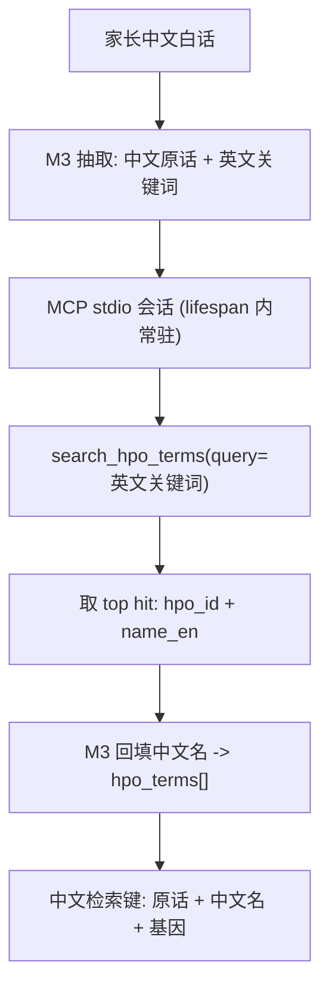

# 00-赛前工具链搭建指南


## 第一步：安装 Cursor 编辑器

1. 访问 Cursor 官网：https://cursor.com/
2. 下载适用于 Mac 的安装包。
3. 下载完成后，将 Cursor 拖入“应用程序”文件夹并运行。
4. 首次启动时按默认设置连续点击 Continue 即可。

## 第二步：配置 GitHub 与可视化协作工具

1. 访问 https://github.com/ 注册 GitHub 账号。
2. 访问 https://desktop.github.com/ 下载并安装 GitHub Desktop。
3. 运行 GitHub Desktop，使用刚注册的账号登录并完成网页授权。
4. 在 GitHub Desktop 中点击 "Create a New Repository on your hard drive"，命名项目库（例如 `hackathon-demo`），并点击 "Publish repository" 将其发布到云端。
5. 回到 Cursor 界面，点击 File -> Open Folder，选择刚刚创建的项目文件夹。

## 第三步：获取 MiniMax API 密钥

1. 访问 MiniMax 开发者平台：https://platform.minimax.io/
2. 注册并登录账号，进入控制台 (Console)。
3. 在左侧导航栏进入 API Keys 管理页面。
4. 点击 Create new key。
5. 复制屏幕上生成的以 `sk-cp-` 开头的密钥，妥善保存在本地（该密钥仅完整显示一次）。

## 第四步：在 Cursor 中配置 MiniMax 算力

1. 在 Cursor 中使用快捷键 `Cmd + ,` 唤出设置面板。
2. 进入左侧导航栏的 Models 选项卡。
3. 关闭列表内所有自带默认模型（如 Claude 3.5 Sonnet, GPT-4o 等）右侧的开关。
4. 点击 Add Model 输入框，输入 `MiniMax-M3`，点击 `+` 号添加，并确保其右侧开关开启。
5. 向下滚动至 API Keys 区域的 OpenAI API Key 板块：
   - 开启板块右侧开关。
   - 在密钥输入框内粘贴第三步获取的 MiniMax 密钥。
   - 开启 Override OpenAI Base URL 开关。
   - 在 Base URL 输入框中严格填入：`https://api.minimax.io/v1`

# SpectrumX：基于 MCP、RAG 与 MiniMax M3 的本地环境搭建全指南

本文档汇集了在 Mac 环境下使用 Cursor 从零开始配置项目的所有步骤，涵盖了 Homebrew 与 Node.js 的环境准备、HPO-MCP-Server 的搭建与测试、以及 RAG (检索增强生成) 模块的构建与前后端（FastAPI + Streamlit）全链路闭环部署。

---

## 阶段一：基础环境准备 (Mac)

### 1.1 安装 Homebrew (包管理器)
打开终端 (Terminal)，执行以下命令安装 Homebrew：
```bash
/bin/bash -c "$(curl -fsSL https://raw.githubusercontent.com/Homebrew/install/HEAD/install.sh)"
```
**配置环境变量 (重要)**：安装完成后，如果终端提示 "Next steps"，请根据您的芯片架构运行配置命令：
* **M系列芯片 (Apple Silicon)**：
  ```bash
  echo 'eval "$(/opt/homebrew/bin/brew shellenv)"' >> ~/.zprofile
  eval "$(/opt/homebrew/bin/brew shellenv)"
  ```
* **Intel 芯片**：
  ```bash
  echo 'eval "$(/usr/local/bin/brew shellenv)"' >> ~/.zprofile
  eval "$(/usr/local/bin/brew shellenv)"
  ```
验证：运行 `brew -v` 确保输出版本号。

*(注：若连接 GitHub 下载缓慢或卡死，可终止命令并尝试使用国内加速源脚本：`/bin/zsh -c "$(curl -fsSL https://gitee.com/cunkai/HomebrewCN/raw/master/Homebrew.sh)"`)*

### 1.2 安装 Node.js 与 npm
```bash
brew install node
```
验证安装：运行 `node -v` (需 v18+) 和 `npm -v`。

### 1.3 安装 Python (3.9+)
本项目后端 (FastAPI)、RAG (ChromaDB) 与前端 (Streamlit) 均基于 Python。使用 Homebrew 安装：
```bash
brew install python
```
验证安装：运行 `python3 --version` (需 3.9 或更高) 和 `pip3 --version`。

### 1.4 创建并激活 Python 虚拟环境 (强烈推荐)
虚拟环境将本项目的依赖与系统 Python 隔离，避免版本冲突。**后续所有 `pip install` 与 `python` 命令都必须在激活虚拟环境后执行。**

1. 在 Cursor 中打开项目根目录，唤出终端 (`Ctrl + ~`)，确认当前位于项目根目录。
2. 创建名为 `.venv` 的虚拟环境：
   ```bash
   python3 -m venv .venv
   ```
3. 激活虚拟环境 (macOS / zsh)：
   ```bash
   source .venv/bin/activate
   ```
   激活成功后，终端提示符前会出现 `(.venv)` 前缀。
4. 升级 pip 至最新版：
   ```bash
   pip install --upgrade pip
   ```
5. 将虚拟环境目录加入 `.gitignore`，避免误提交：
   ```bash
   echo ".venv/" >> .gitignore
   ```

> **提示**：每次新开终端窗口都需重新执行 `source .venv/bin/activate`。退出虚拟环境使用命令 `deactivate`。
>
> **一键安装依赖**：建议在项目根目录创建 `requirements.txt`（内容见 [附录：requirements.txt](#附录requirementstxt)），随后执行 `pip install -r requirements.txt` 即可一次性装齐所有 Python 依赖，无需再逐条 `pip install`。

---

## 阶段二：搭建与配置 HPO-MCP-Server

该服务用于将家长的白话文症状描述，通过大模型转化为标准的 HPO 医学表型术语。

### 2.1 下载与编译
**在项目根目录**（即本仓库根目录）执行，让服务器落在 `HPO-MCP-Server/` 子目录下：
```bash
git clone https://github.com/Augmented-Nature/HPO-MCP-Server.git
cd HPO-MCP-Server
npm install
npm run build
```
`npm install` 会自动触发一次 `prepare` -> `npm run build`，所以看到重复的 build 输出属于正常现象。编译产物为 `HPO-MCP-Server/build/index.js`。

> `npm install` 结尾提示的 vulnerabilities 与 npm 新版本通知可以忽略，不影响本地 MCP 服务运行；**不要**执行 `npm audit fix --force`，它会引入破坏性升级。

### 2.2 注册 MCP 服务器（编辑 mcp.json）
当前版本的 Cursor 已取消旧的 `Settings -> Features -> MCP -> + Add New MCP Server` 表单，自定义 MCP 服务器统一通过 `mcp.json` 配置文件管理。

本项目采用**项目级配置**：仓库根目录下的 [`.cursor/mcp.json`](../.cursor/mcp.json)（已随仓库提交，clone 下来即生效，无需每人手动添加）：

```json
{
  "mcpServers": {
    "hpo-server": {
      "type": "stdio",
      "command": "node",
      "args": ["${workspaceFolder}/HPO-MCP-Server/build/index.js"]
    }
  }
}
```

其中 `${workspaceFolder}` 是 Cursor 官方支持的插值变量，指向包含 `.cursor/mcp.json` 的项目根目录。用它而不是绝对路径，团队每个人的机器都能直接复用同一份配置。

**在 Cursor 界面里打开该文件的方式**：点击侧边栏的 **Customize** -> 找到 MCP 区域 -> 点击 **New MCP Server**，Cursor 会直接打开 `mcp.json` 供编辑（而不是弹出表单）。

> **可选：全局配置**。若你希望在所有项目中都能用这台服务器，改为编辑 `~/.cursor/mcp.json`，此时 `${workspaceFolder}` 不再适用，`args` 必须填写绝对路径，例如 `["/Users/yourname/Desktop/hackathon-genetic-counseling-agent/HPO-MCP-Server/build/index.js"]`。

配置保存后，需要重新加载 Cursor 窗口（`Cmd + Shift + P` -> `Developer: Reload Window`），或在 Customize 面板把 `hpo-server` 开关关掉再打开，服务器才会连接。

### 2.3 验证服务是否正常
**方式一：命令行自检（推荐，无需浏览器）**。在项目根目录执行，直接与服务器做一次 MCP 握手并列出工具：
```bash
cd HPO-MCP-Server
printf '%s\n' \
  '{"jsonrpc":"2.0","id":1,"method":"initialize","params":{"protocolVersion":"2024-11-05","capabilities":{},"clientInfo":{"name":"probe","version":"1.0"}}}' \
  '{"jsonrpc":"2.0","method":"notifications/initialized"}' \
  '{"jsonrpc":"2.0","id":2,"method":"tools/list","params":{}}' \
  | node build/index.js
```
预期：stderr 输出 `HPO MCP server running on stdio`，stdout 返回两条 JSON，其中包含 `"name":"hpo-server"` 以及 12 个工具名（`search_hpo_terms`、`get_hpo_term`、`get_hpo_ancestors`、`get_hpo_parents`、`get_hpo_children`、`get_hpo_descendants`、`validate_hpo_id`、`get_hpo_term_path`、`compare_hpo_terms`、`get_hpo_term_stats`、`batch_get_hpo_terms`、`get_all_hpo_terms`）。

**方式二：在 Cursor 内确认**。打开侧边栏 **Customize**，`hpo-server` 应显示为已连接并列出 12 个工具。若连接失败，打开输出面板（`Cmd + Shift + U`）在下拉框中选择 **MCP Logs** 查看启动报错。

**方式三：图形化排查（可选）**。用官方 Inspector 交互式调用工具：
```bash
npx @modelcontextprotocol/inspector node ./build/index.js
```

### 2.4 冒烟测试（确认端到端可用）
在 Cursor 的 Chat 中输入：
```
用 search_hpo_terms 搜索 seizure
```
预期返回 `HP:0001250 Seizure` 及其定义。该服务器直连公开 API `https://ontology.jax.org/api/hp`，**无需任何 API Key**，但需要联网。

> **重要：语言限制**。HPO 官方 API 只索引英文术语，直接拿中文白话（如“整天傻笑”）去查会检索不到。因此本项目的调用链必须是：先由 MiniMax M3 把家长口语描述翻译成英文医学关键词（如 `inappropriate laughter`），再交给 `search_hpo_terms` 换取标准 HPO 编码 —— 这正是 PRD 中「MCP 翻译官」这一角色的落地方式。

### 2.5 注意事项：队友首次拉取项目
`HPO-MCP-Server/` 已被根目录 `.gitignore` 忽略（内含体积巨大的 `node_modules`，不纳入本仓库）。因此**每位成员 clone 本仓库后都必须自行执行一次 2.1 的 clone + `npm install`**，否则 `.cursor/mcp.json` 指向的 `build/index.js` 不存在，Cursor 会报服务器启动失败。

---

## 阶段三：搭建本地 RAG (检索增强生成) 模块

此模块用于构建本地的医学知识向量库（鉴别诊断、基因测序科学解读、合规声明），供后续的检索调用。

### 3.1 安装核心 Python 库
确认已激活虚拟环境（终端提示符含 `(.venv)`，见 [1.4 节](#14-创建并激活-python-虚拟环境-强烈推荐)），然后运行：
```bash
pip install chromadb sentence-transformers
```

> **为什么不装 langchain**：本项目的切分逻辑用标准库几十行就能实现，而 langchain 依赖极重、安装耗时长，在 36 小时冲刺里性价比很低，故不引入。

> **Embedding 模型选择（重要）**：我们的知识库是**中文**，因此必须使用中文或多语言向量模型。项目统一采用 `BAAI/bge-small-zh-v1.5`（约 95MB）。切勿使用 `all-MiniLM-L6-v2` —— 它是纯英文模型，对中文文本的向量化效果接近随机，检索会完全失准。**灌库与检索两端必须使用同一个模型**，换模型后必须重新运行 `scripts/rag_builder.py`。模型名统一由根目录 `config.py` 提供（见 3.4 节），两端都从那里读，不要各写一份默认值。

### 3.2 知识库语料：双来源

语料已结构化落盘，不再硬编码在脚本里：

* **精编切片**（已就位）：`data/knowledge/bucket_a_differential.json`、`bucket_b_vus.json`、`bucket_c_compliance.json`，共 10 条，内容逐条对应 [后端知识库架构与数据字典](./后端知识库架构与数据字典.md)。这是合规安全的核心，**即使不下载原文也能跑通全链路**。
* **原文切片**（需手动下载）：按 [data/knowledge/SOURCES.md](../data/knowledge/SOURCES.md) 的清单，把 6 篇 GeneReviews 与 2 篇 PubMed 摘要存为 txt 放进 `data/knowledge/raw/`。灌库脚本会自动切分。

> **合规红线（必读）**：GeneReviews 每篇都含 **Management / Treatment** 章节，里面有明确的药名与剂量方案。这些内容一旦进入向量库，就可能被检索并被大模型引用，直接击穿本项目 Non-Device CDS 的立身之本。因此 `scripts/rag_builder.py` 内置两道防线：按章节标题**强制丢弃**干预类章节；以及对每个切片做用药词兜底扫描，命中即丢弃。**请勿绕过这两道过滤。**

### 3.3 灌库脚本 `scripts/rag_builder.py`

脚本已就位，核心逻辑：

1. 读取 `data/knowledge/*.json` 精编切片，全部入库，标记 `origin=curated`。
2. 读取 `data/knowledge/raw/*.txt` 原文，按章节标题过滤（白名单保留 Clinical Characteristics、Differential Diagnosis 等描述性章节；黑名单丢弃 Management、Treatment、Surveillance、Agents and Circumstances to Avoid 等）。
3. 对保留章节做滑窗切分（约 500 字，重叠 80 字），逐片扫描用药关键词，命中即丢弃并告警。
4. 合并去重后写入 ChromaDB，collection 名 `autism_genetics_knowledge`，metadata 含 `bucket` / `source` / `condition` / `gene` / `origin`。

运行：

```bash
python scripts/rag_builder.py --dry-run   # 先干跑，检查切分与过滤统计，不写库
python scripts/rag_builder.py             # 确认无误后正式灌库
```

> 两条命令都在**项目根目录**执行。脚本会把根目录加入 `sys.path` 后 `import config`，从别处调用相对路径会失效。

干跑输出示例（尚未下载原文时）：

```text
读取精编切片...
  精编切片 10 条
读取原文语料...
  未发现原文语料。仅使用精编切片。
合计入库 10 条切片（桶 A 7，桶 B 2，桶 C 1）
```

下载原文后会额外打印每份文件的收录条数，以及 `合规过滤：丢弃干预/用药章节 N 个 ... 用药词拦截 M 条`。**务必确认这两个数字大于 0**，否则说明章节标题在复制粘贴时丢失，过滤未生效。

### 3.4 共享配置 `config.py`

根目录的 `config.py` 是全项目唯一读取 `.env` 的地方，向灌库脚本、后端与验收脚本提供同一份常量：

| 常量 | 用途 |
|---|---|
| `COLLECTION_NAME` | ChromaDB collection 名，**不走环境变量**，两端必须字面相同 |
| `EMBEDDING_MODEL` / `CHROMA_PATH` | 向量模型与持久化目录 |
| `KNOWLEDGE_DIR` / `RAW_DIR` / `TEST_CASE_DIR` / `FIXTURES_DIR` | 各数据目录的绝对路径，与当前工作目录无关 |
| `BACKEND_URL` | 前端与验收脚本访问后端的地址 |
| `MINIMAX_API_KEY` / `MINIMAX_BASE_URL` / `MINIMAX_MODEL` | 大模型调用参数 |
| `official_disclaimer()` | 读取桶 C 免责声明原文，后端与验收脚本共用同一入口 |

> **为什么要有这个文件**：灌库与检索若用了不同的 embedding 模型或 collection 名，检索**不会报错**，只会返回一堆语义无关的切片。这种故障在演示现场几乎不可能当场定位。把常量收在一处，物理上消除这种漂移。

根目录模块直接 `import config`；`scripts/` 下的脚本需先把项目根加入 `sys.path`：

```python
import sys
from pathlib import Path

sys.path.insert(0, str(Path(__file__).resolve().parent.parent))

from config import COLLECTION_NAME, EMBEDDING_MODEL
```

### 3.5 检索逻辑

检索由后端 `main.py` 内部完成，查询键为「标准化症状 + 基因变异名」，因知识库为中文，查询串也必须是中文。若要单独验证检索质量，可用（注意它同样从 `config` 取模型名与 collection，避免手写造成不一致）：

```bash
python -c "
import chromadb
from chromadb.utils import embedding_functions
from config import CHROMA_PATH, COLLECTION_NAME, EMBEDDING_MODEL
ef = embedding_functions.SentenceTransformerEmbeddingFunction(model_name=EMBEDDING_MODEL)
col = chromadb.PersistentClient(path=CHROMA_PATH).get_collection(COLLECTION_NAME, embedding_function=ef)
r = col.query(query_texts=['症状: 频繁大笑 步态不稳 无语言 基因: UBE3A 缺失'], n_results=3)
[print('-', d[:80], m) for d, m in zip(r['documents'][0], r['metadatas'][0])]
"
```

预期首条命中安格曼综合征相关切片。

---

## 阶段四：闭环组装 (后端 FastAPI 衔接 MCP, RAG 与 MiniMax)

构建轻量级后端 API，串联真实 MCP 标准化、RAG 检索以及 MiniMax 大模型生成，最后套用合规护栏。

### 4.1 安装后端依赖
（同样在已激活的虚拟环境下运行）
```bash
pip install fastapi uvicorn requests python-dotenv mcp
```

其中 `mcp` 是 MCP 官方 Python SDK，后端用它以 stdio 方式调用 HPO-MCP-Server。

### 4.2 配置环境变量 (.env)
项目根目录已提供模板 [.env.example](../.env.example)，复制后填入真实值：

```bash
cp .env.example .env
```

必填两项：

| 变量 | 说明 |
|---|---|
| `MINIMAX_API_KEY` | [第三步](#第三步获取-minimax-api-密钥) 获取的 MiniMax 密钥，形如 `sk-cp-...` |
| `HPO_MCP_SERVER_PATH` | `HPO-MCP-Server/build/index.js` 的**绝对路径**，每台机器不同 |

其余（`MINIMAX_BASE_URL`、`MINIMAX_MODEL`、`CHROMA_DB_PATH`、`EMBEDDING_MODEL`、`BACKEND_URL`）留空即用代码内默认值。

> **安全提示**：`.env` 已在根目录 [.gitignore](../.gitignore) 中被忽略，严禁将密钥提交到 GitHub。`.env.example` 只放占位符，可以安全提交。

### 4.3 MCP 集成：中译英两段式

HPO 官方 API 只索引英文术语，而家长输入是中文，因此标准化必须分两段走：



**性能要点**：MCP 会话必须在 FastAPI 的 `lifespan` 内建立并复用，**不要每个请求都重启子进程**（每次冷启动约 1-2 秒，逐词查询会累积成十几秒的等待）。骨架如下：

```python
from contextlib import asynccontextmanager
from mcp import ClientSession, StdioServerParameters
from mcp.client.stdio import stdio_client

from config import HPO_MCP_SERVER_PATH

@asynccontextmanager
async def lifespan(app: FastAPI):
    params = StdioServerParameters(
        command="node",
        args=[HPO_MCP_SERVER_PATH],
    )
    async with stdio_client(params) as (read, write):
        async with ClientSession(read, write) as session:
            await session.initialize()
            app.state.hpo = session          # 全局复用
            yield

app = FastAPI(title="ASD-GenDecoder Backend", lifespan=lifespan)

# 调用方式
result = await app.state.hpo.call_tool("search_hpo_terms", {"query": "inappropriate laughter", "max": 3})
```

### 4.4 编写后端 API (main.py)

响应结构以 [docs/schema.md](./schema.md) 为唯一事实来源，**不要自行发明字段**。实现时必须满足的四条硬约束：

1. **响应八字段**：`status`、`hpo_terms`、`comparisons`、`vus_reassurance`、`next_steps`、`disclaimer`、`mcp_translation`、`retrieved_chunks`。
2. **`disclaimer` 由后端硬填充**：调用 `config.official_disclaimer()` 取桶 C 原文直接赋值，**不经大模型生成**。靠 prompt 祈使模型输出免责声明是不可靠的，这一条是 AC4 的结构性保障。验收脚本用的是同一个函数，所以只要走这条路就不可能对不上。
3. **要求 M3 返回结构化 JSON**：system prompt 中明确输出 schema，后端解析后填充 `hpo_terms` 之外的业务字段；解析失败时抛 `MINIMAX_API_ERROR`，禁止把原始文本透传给前端。
4. **错误契约按 HTTP 状态码分流**：

| 场景 | HTTP | `error_code` |
|---|---|---|
| `symptoms` 或 `gene_report` 为空/全空白 | 422 | `INVALID_INPUT` |
| 未读取到 `MINIMAX_API_KEY` | 500 | `MISSING_API_KEY` |
| Minimax 非 200、超时或返回无法解析 | 502 | `MINIMAX_API_ERROR` |

错误响应体统一为 `{"status": "error", "error_code": ..., "error_message": ...}`，建议用 FastAPI 的 `exception_handler` 统一收口，避免每个分支各写一遍。

**启动后端**: `uvicorn main:app --reload --port 8000`
*(可通过 `http://127.0.0.1:8000/docs` 访问 Swagger UI 测试 API)*

### 4.5 验收自检

后端跑起来后，用现成的验收脚本一次性检查 PRD 的 AC1-AC6：

```bash
python scripts/run_acceptance.py
```

它会把 `data/test_cases/` 下的 7 个用例逐条 POST 给后端，校验字段完整性、HPO 编码格式、免责声明逐字一致、就诊科室、禁用词、错误码等。全通过退出码为 0。

---

## 阶段五：前端可视化 (Streamlit)
前端实现不在本文维护第二份代码示例。请严格依照以下两个唯一事实来源：

1. 响应字段、错误码与空值语义：[schema.md](./schema.md)。
2. 组件、状态机、CSS、函数名与调用顺序：[UI_BLUEPRINT.md](./UI_BLUEPRINT.md)。

关键约束：

- `app.py` 使用 `from config import BACKEND_URL`；`config.py` 是全项目唯一读取 `.env` 的入口。
- 前端仅调用 `POST {BACKEND_URL}/api/screen`，不得直连 Minimax、ChromaDB 或 HPO。
- `disclaimer` 在 idle / loading / success / error 四种状态都必须完整展示；非成功态从桶 C 本地回退加载。
- 禁止 emoji、`st.table` / `st.dataframe`、`st.json`、默认红色错误组件，以及用 `st.expander` 承载知识切片。
- `.streamlit/config.toml` 按 UI 蓝图 §1.5 钉死浅色主题。

**启动前端**：

```bash
streamlit run app.py
```

需保持阶段四的后端 `uvicorn` 进程处于运行状态。

此时，一套打通 MCP + RAG + FastAPI + Streamlit 的本地化全链路 MVP 就已成功跑通。

---

## 附录：requirements.txt

仓库根目录已提供 [requirements.txt](../requirements.txt)，一次性锁定所有 Python 依赖，激活虚拟环境后执行 `pip install -r requirements.txt` 即可。内容如下：

```text
# 向量库与中文向量化
chromadb
sentence-transformers

# 后端
fastapi
uvicorn
mcp

# 前端
streamlit

# 通用
requests
python-dotenv
```

> 运行顺序回顾：
> 1. `source .venv/bin/activate`
> 2. `pip install -r requirements.txt`
> 3. `cp .env.example .env` 并填入 `MINIMAX_API_KEY` 与 `HPO_MCP_SERVER_PATH`
> 4. `python scripts/rag_builder.py`（灌库，首次会下载约 95MB 的向量模型）
> 5. `uvicorn main:app --reload --port 8000`（后端）
> 6. 新开终端并再次激活虚拟环境，`streamlit run app.py`（前端）
> 7. `python scripts/run_acceptance.py`（验收自检）